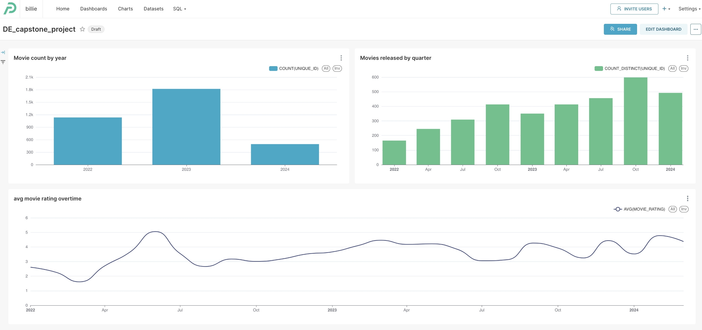
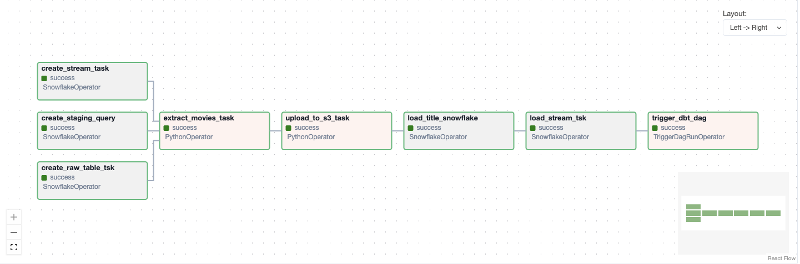
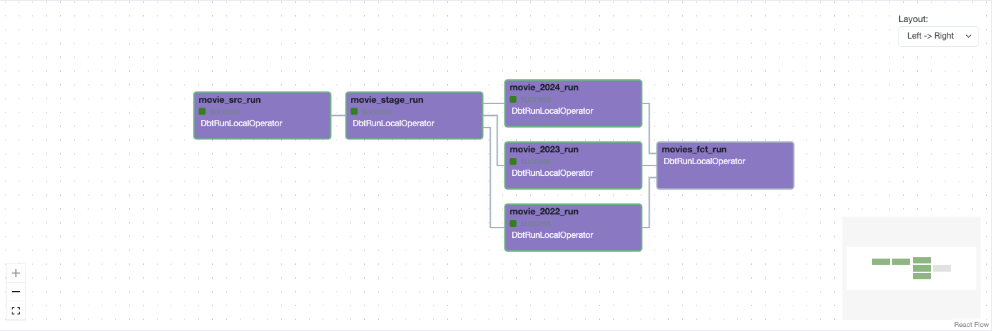

# bootcamp_DE_project_2024
This repository contains the project from my data engineering bootcamp on Datatalk


##Setting up terraform for snowflake, this guide was helpful
#https://quickstarts.snowflake.com/guide/terraforming_snowflake/index.html#2


---

# Project Overview

This project fetches historical data from the Netflix API covering the years 2022 to 2024. The goal is to group the data by year and analyze the best-performing movies in terms of rating, as well as their distribution. Additionally, the project aims to display the latest released movies, with the data being refreshed daily.

## Key Components

- **AWS Setup**: The project utilizes AWS services s3 via Airflow. Make sure to set up AWS connections for seamless integration.
- **Terraform Infrastructure**: Infrastructure provisioning and teardown are managed using Terraform.
- **dbt (Data Build Tool)**: dbt is used for data transformation tasks, with a separate DAG dedicated to running dbt jobs.
- **TriggerDagRunOperator**: Airflow's `TriggerDagRunOperator` is used to initiate dbt DAG for data transformation after the etl DAG completes.
- **Snowflake Integration**: Snowflake is utilized for data storage and analysis. Ensure Snowflake connection is set up properly.
- **AWS Access and Secret Keys**: AWS access and secret keys are required and should be configured in a `.env` file.
- **Astro**: Astro is used for managing Airflow configurations.
- **Initiate Project**: Start the project using `astro dev start`.


## Viewing My Dashboard

To view my dashboard please use this permerlink:
You may be required to just sign up to view this dashboard on preset

https://20edd4d1.us2a.app.preset.io/superset/dashboard/p/mvdR8VN8ngP/

Do email me if you need any permission, preset makes it a bit difficult to share dashboard publicly
However I have attached some images below for a reference
My email: anamsken60@gmail.com


### My preset dashboard



## My etl pipeline


### DBT dag



## Running the Project

To start the project, execute the following command:

```bash
astro dev start

